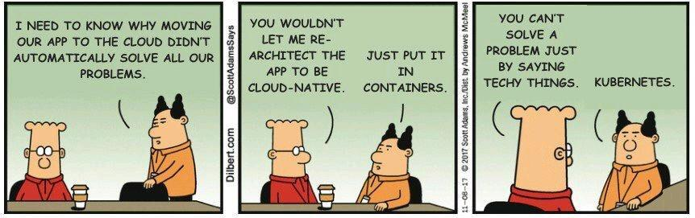

<h1 align="left" id="hamzab70-title">:wave: Hello there! I'm Hamza</h1>
<h3 align="left">I do Cloud/Infrastructure Engineering things</h3>

- :office: &nbsp;I'm currently working at **[Novanta]**
- :seedling: &nbsp;I’m currently working on my **[dotfiles]**
- :speech_balloon: &nbsp;I like to talk about **K8s** and other **OSS**
- :mailbox: &nbsp;Ask me anything on my **[issues page]**
- :computer: &nbsp;Connect with me on **[LinkedIn]**

 

 

<h2 align="left" id="hamzab70-tech">Favorite Tech</h2>

> Tools, languages, and other things that I like to work with.

<table>
  <tr>
    <td align="center" width="96">
      
       Bash
    </td>
    <td align="center" width="96">
      
       Python
    </td>
    <td align="center" width="96"> 
      
       Docker
    </td>
    <td align="center" width="96">
      
       Kubernetes
    </td>
    <td align="center" width="96">
      
       Openshift
    </td>
    <td align="center" width="96">
      
       Helm
    </td>
    <td align="center" width="96">
      
       ArgoCD
    </td>
  </tr>
  <tr>
    <td align="center" width="96"> 
      
       Terraform
    </td>
    <td align="center" width="96">
      
       Azure Devops
    </td>
    <td align="center" width="96">
      
       Azure Pipelines
    </td>
    <td align="center" width="96">
      
       PostgreSQL
    </td>
    <td align="center" width="96">
      
       Prometheus
    </td>
    <td align="center" width="96">
      
       Elastic Stack
    </td>
    <td align="center" width="96"> 
      
       Nginx
    </td>
  </tr>
</table>

<!-- links -->

[Novanta]: https://novanta.com "Novanta Group Home Page"
[dotfiles]: https://github.com/hamzab70/.dotfiles "hamzab70/.dotfiles"
[issues page]: https://github.com/hamzab70/hamzab70/issues "hamzab70/issues"
[linkedin]: https://www.linkedin.com/in/hamza-boulaich/ "Hamza Boulaich LinkedIn"